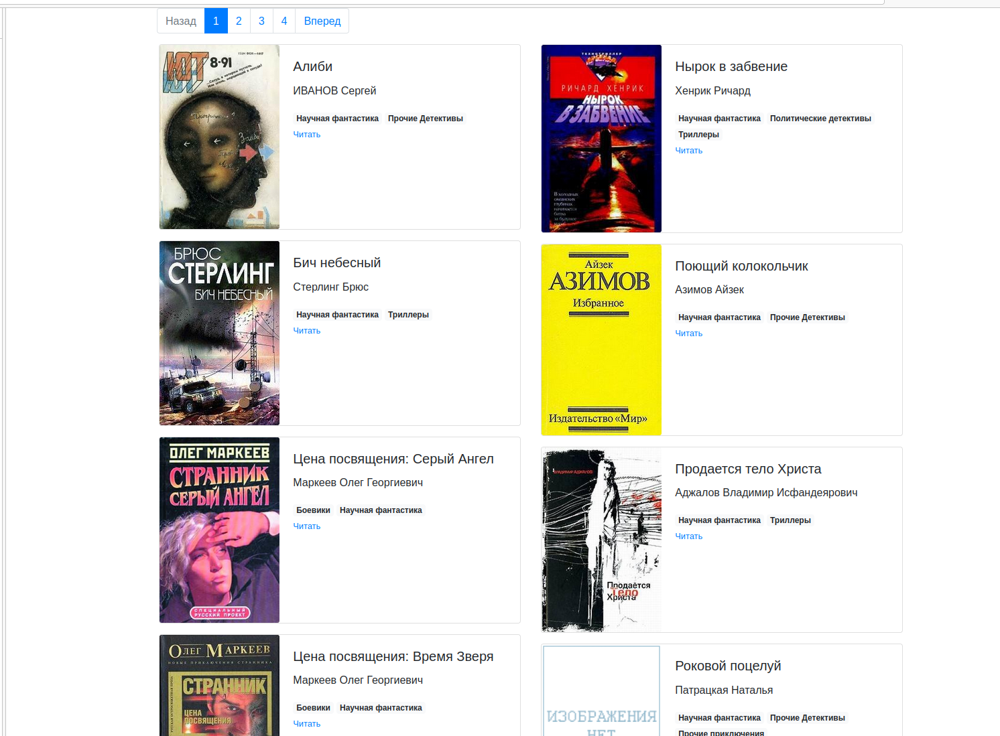

# E-library

## Project description

Project consist of two parts:

* Scripts allow you to download books from electronic library from this [address](https://tululu.org/);
* HTML pages of book library


#### Website published [here](https://artemsav.github.io/e-lidbary/)

### lib_request script

To run the first one you shall use the following command:

```bash
python lib_request.py 1 10
```

Where the numbers ```1 10``` it is ```id``` of the books on [electronic library](https://tululu.org/). Typical address of the page of the book is ```https://tululu.org/b20/```
When the scripts creates two folders ```books``` with .txt files with book-text and ```images``` with book cover picture.

### parse_tululu_category script

This script is prepared to download fantastic-genre books from [library](https://tululu.org/). You can set the pages of the library to be parsed. Additionally there is extended functionality via the following optional arguments:

* ``--start_page`` and ```--end_page``` - They control from which to which page to download.
* ```--dest_folder``` - path to the directory with parsing results: pictures, books, JSON.
* ```--skip_imgs``` - do not download images
* ```--skip_txt``` - do not download books
* ```--json_path``` — specify your path to *.json file with results

To run the second one you shall use the following command:

```bash
python parse_tululu_category --start_page 700 --end_page 701 --dest_folder dest_folder --skip_txt --json_path json
```

All arguments are optional. This command will download all books from the pages ```700``` to ```701``` to folder ```dest_folder``` without ```.txt``` files.
Result metadata of downloaded books stored in ```result.json```

### render_website.py

The script form the ```index.html``` pages. As input it takes ```result.json``` and ```template.html``` to make result html pages with following naming ```index1.html```, ```index2.html``` based on the ammount of books. Books distributed in two column 10 books each.
Also the script run simple local webserver serving on ```http://127.0.0.1:5500```. To run server please use the command:

```bash
python render_website.py 
```

## Instalation

Python3 should be already installed. Then use pip (or pip3, if there is a conflict with Python2) to install dependencies:

```bash
pip install -r requirements.txt
```

## Project Goals

The code is written for educational purposes on online-course for web-developers [Devman](https://dvmn.org)
